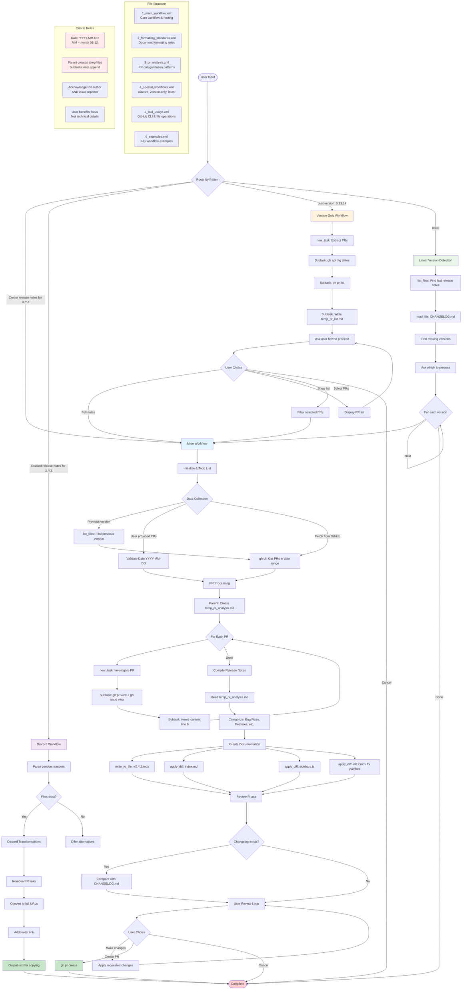

```mermaid
graph TB
    Start([User Input]) --> Router{Route by Pattern}
    
    %% Entry Pattern Routing
    Router -->|"Create release notes for X.Y.Z"| MainWorkflow[Main Workflow]
    Router -->|"Discord release notes for X.Y.Z"| DiscordWorkflow[Discord Workflow]
    Router -->|"Just version: 3.23.14"| VersionOnly[Version-Only Workflow]
    Router -->|"latest"| LatestWorkflow[Latest Version Detection]
    
    %% Main Workflow
    MainWorkflow --> Init[Initialize & Todo List]
    Init --> DataCollection{Data Collection}
    DataCollection -->|Previous version| FindPrevious[list_files: Find previous version]
    DataCollection -->|User provided PRs| DateValidation[Validate Date YYYY-MM-DD]
    DataCollection -->|Fetch from GitHub| FetchPRs[gh cli: Get PRs in date range]
    
    FindPrevious --> FetchPRs
    DateValidation --> ProcessPRs
    FetchPRs --> ProcessPRs
    
    %% PR Processing
    ProcessPRs[PR Processing] --> CreateTemp[Parent: Create temp_pr_analysis.md]
    CreateTemp --> SubtaskLoop{For Each PR}
    SubtaskLoop --> CreateSubtask[new_task: Investigate PR]
    CreateSubtask --> SubtaskWork[Subtask: gh pr view + gh issue view]
    SubtaskWork --> AppendFindings[Subtask: insert_content line 0]
    AppendFindings --> SubtaskLoop
    SubtaskLoop -->|Done| Compilation
    
    %% Compilation & Documentation
    Compilation[Compile Release Notes] --> ReadTemp[Read temp_pr_analysis.md]
    ReadTemp --> Categorize[Categorize: Bug Fixes, Features, etc.]
    Categorize --> CreateFiles[Create Documentation]
    CreateFiles --> ReleaseFile[write_to_file: vX.Y.Z.mdx]
    CreateFiles --> UpdateIndex[apply_diff: index.md]
    CreateFiles --> UpdateSidebar[apply_diff: sidebars.ts]
    CreateFiles --> UpdateCombined[apply_diff: vX.Y.mdx for patches]
    
    ReleaseFile --> Review
    UpdateIndex --> Review
    UpdateSidebar --> Review
    UpdateCombined --> Review
    
    %% Review Phase
    Review[Review Phase] --> CrossRef{Changelog exists?}
    CrossRef -->|Yes| CompareChangelog[Compare with CHANGELOG.md]
    CrossRef -->|No| UserReview
    CompareChangelog --> UserReview[User Review Loop]
    UserReview --> ReviewChoice{User Choice}
    ReviewChoice -->|Make changes| ApplyChanges[Apply requested changes]
    ApplyChanges --> UserReview
    ReviewChoice -->|Create PR| CreatePR[gh pr create]
    ReviewChoice -->|Cancel| End
    
    %% Discord Workflow
    DiscordWorkflow --> ParseVersions[Parse version numbers]
    ParseVersions --> CheckFiles{Files exist?}
    CheckFiles -->|Yes| ApplyTransforms[Discord Transformations]
    CheckFiles -->|No| AskUser[Offer alternatives]
    ApplyTransforms --> RemovePRLinks[Remove PR links]
    RemovePRLinks --> ConvertLinks[Convert to full URLs]
    ConvertLinks --> AddFooter[Add footer link]
    AddFooter --> OutputDiscord[Output text for copying]
    
    %% Version-Only Workflow
    VersionOnly --> ExtractSubtask[new_task: Extract PRs]
    ExtractSubtask --> GetDateRange[Subtask: gh api tag dates]
    GetDateRange --> SearchPRs[Subtask: gh pr list]
    SearchPRs --> WritePRList[Subtask: Write temp_pr_list.md]
    WritePRList --> PresentOptions[Ask user how to proceed]
    PresentOptions --> UserDecision{User Choice}
    UserDecision -->|Full notes| MainWorkflow
    UserDecision -->|Show list| DisplayList[Display PR list]
    UserDecision -->|Select PRs| FilterPRs[Filter selected PRs]
    UserDecision -->|Cancel| End
    DisplayList --> PresentOptions
    FilterPRs --> MainWorkflow
    
    %% Latest Workflow
    LatestWorkflow --> FindLast[list_files: Find last release notes]
    FindLast --> ReadChangelog[read_file: CHANGELOG.md]
    ReadChangelog --> CompareVersions[Find missing versions]
    CompareVersions --> ConfirmVersions[Ask which to process]
    ConfirmVersions --> ProcessSelected{For each version}
    ProcessSelected --> MainWorkflow
    ProcessSelected -->|Next| ProcessSelected
    ProcessSelected -->|Done| End
    
    %% End States
    CreatePR --> End([Complete])
    OutputDiscord --> End
    
    %% File Structure Reference
    subgraph "File Structure"
        F1[1_main_workflow.xml<br/>Core workflow & routing]
        F2[2_formatting_standards.xml<br/>Document formatting rules]
        F3[3_pr_analysis.xml<br/>PR categorization patterns]
        F4[4_special_workflows.xml<br/>Discord, version-only, latest]
        F5[5_tool_usage.xml<br/>GitHub CLI & file operations]
        F6[6_examples.xml<br/>Key workflow examples]
    end
    
    %% Critical Rules
    subgraph "Critical Rules"
        R1[Date: YYYY-MM-DD<br/>MM = month 01-12]
        R2[Parent creates temp files<br/>Subtasks only append]
        R3[Acknowledge PR author<br/>AND issue reporter]
        R4[User benefits focus<br/>Not technical details]
    end
    
    style MainWorkflow fill:#e1f5fe
    style DiscordWorkflow fill:#f3e5f5
    style VersionOnly fill:#fff3e0
    style LatestWorkflow fill:#e8f5e9
    style CreatePR fill:#c8e6c9
    style OutputDiscord fill:#c8e6c9
    style End fill:#ffcdd2
    style R1 fill:#ffebee
    style R2 fill:#ffebee
```