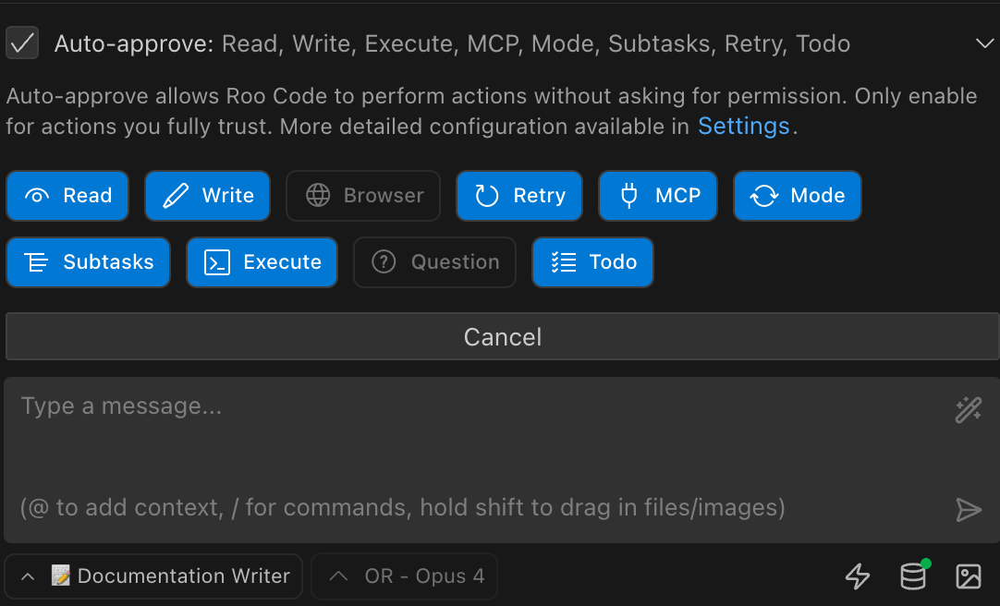

# Roo Code 3.25.5 Release Notes (2025-08-01)

This release adds Cerebras AI provider support with powerful Qwen 3 Coder models, introduces auto-approved cost limits for better budget control, and includes important bug fixes for VB.NET indexing and message handling.

## Cerebras Provider Support

We've added support for Cerebras as a new AI provider (thanks kevint-cerebras!) ([#6392](https://github.com/RooCodeInc/Roo-Code/pull/6392), [#6562](https://github.com/RooCodeInc/Roo-Code/pull/6562)):

- **Qwen 3 Coder Models**: Access to Qwen 3 Coder with both free and paid tier options
- **Multiple Model Variants**: Includes Llama 3.3 70B and various Qwen 3 configurations (32B, 235B)
- **Automatic Thinking Token Filtering**: Cerebras reasoning models automatically filter thinking tokens for cleaner output

The Cerebras provider offers competitive performance with flexible pricing tiers, making it an excellent choice for both experimentation and production use.

> **📚 Documentation**: See [Cerebras Provider Guide](/providers/cerebras) for setup instructions and available models.

## Auto-approved Cost Limits

We've introduced a new cost control feature in the auto-approve settings to help manage API spending (thanks hassoncs!) ([#6484](https://github.com/RooCodeInc/Roo-Code/pull/6484)):

- **Budget Protection**: Set a maximum cost limit in your auto-approve settings to control total API spending
- **Automatic Prompting**: Roo Code will prompt for approval when approaching your cost limit
- **Complements Request Limits**: Works alongside existing request count limits for comprehensive control

This feature provides peace of mind when using expensive models or running long sessions, ensuring you stay within budget. You can find this new "Max Cost" setting alongside the existing "Max Count" in the auto-approve configuration panel.

## QOL Improvements

* **Auto-approve UI**: Cleaner and more streamlined interface with improved localization ([#6538](https://github.com/RooCodeInc/Roo-Code/pull/6538))

* **Command Validation**: Better handling of background execution (`&`) and subshell patterns like `(cmd1; cmd2)` ([#6486](https://github.com/RooCodeInc/Roo-Code/pull/6486))

## Bug Fixes

* **VB.NET Indexing**: Files are now properly indexed in large monorepos using fallback chunking (thanks JensvanZutphen!) ([#6552](https://github.com/RooCodeInc/Roo-Code/pull/6552))
* **Message Sending**: Restored functionality when clicking the save button ([#6487](https://github.com/RooCodeInc/Roo-Code/pull/6487))
* **Search/Replace Tolerance**: More forgiving of AI-generated diffs with extra `>` characters ([#6537](https://github.com/RooCodeInc/Roo-Code/pull/6537))
* **Qdrant Deletion**: Gracefully handles deletion errors to prevent indexing interruption ([#6296](https://github.com/RooCodeInc/Roo-Code/pull/6296))
* **LM Studio Context Length**: Models now correctly display their actual context length instead of "1" (thanks pwilkin, Angular-Angel!) ([#6183](https://github.com/RooCodeInc/Roo-Code/pull/6183))
* **Claude Code Errors**: ENOENT errors now show helpful installation guidance (thanks JamieJ1!) ([#5867](https://github.com/RooCodeInc/Roo-Code/pull/5867))

## Misc Improvements

* **Slash Command Interpolation**: Skip interpolation for non-existent commands ([#6475](https://github.com/RooCodeInc/Roo-Code/pull/6475))
* **Linter Coverage**: Applied to locale README files (thanks liwilliam2021!) ([#6477](https://github.com/RooCodeInc/Roo-Code/pull/6477))
* **Cloud Service Events**: Migrated from callbacks to event-based architecture ([#6519](https://github.com/RooCodeInc/Roo-Code/pull/6519))
* **Website Updates**: Phase 1 improvements (thanks thill2323!) ([#6085](https://github.com/RooCodeInc/Roo-Code/pull/6085))